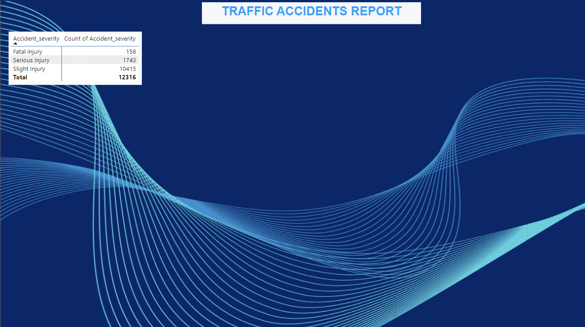
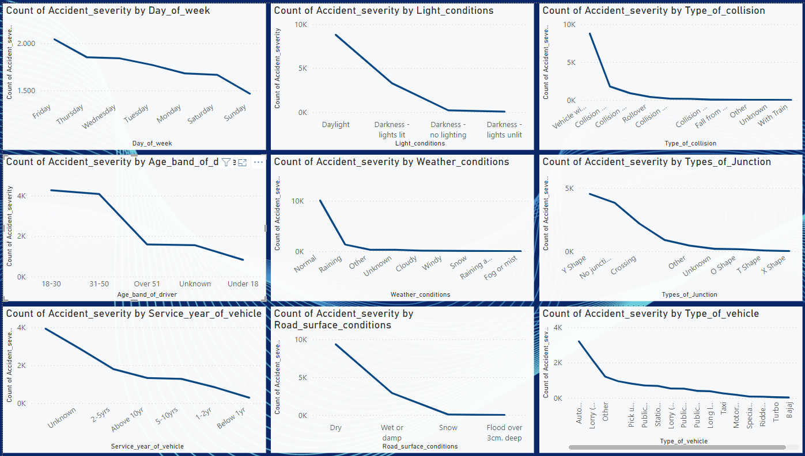

<!-- Markdown con HTML para un encabezado fijo -->
<html>

  <head>
    
  </head>

  <body>
    

      

        
        
      

      

        <h1>TRAFFIC ACCIDENTS ANALYSIS</h1>
        <h4 style="white-space: pre;">Diego Gerwig      2024-SEP      Bilbao</h4>
      

    

  </body>

</html>

#
#
#
#
# 🎯 NATURALEZA DEL PROYECTO

Este proyecto se centra en el análisis de los datos de accidentes de tráfico. La principal finalidad es analizar las diferentes varibles de cada accidente y obtener un modelo que prediga la lesividad. El proyecto involucra la recolección, limpieza, y análisis de datos para proporcionar el pronóstico de heridos, de cara a poder tomar acciones que reduzcan la gravedad de las lesiones.

# 📊 ANALISIS DE DATOS

## Fuente de datos

La fuente de datos ha sido [KAGGLE](https://www.kaggle.com/datasets/saurabhshahane/road-traffic-accidents/data).

Tamaño del dataset:
* Registros: 12316
* Columnas: 32 (2 int & 30 object)

Columnas con valores NULOS: 26

Máximo de valores nulos: 4427

Registros DUPLICADOS: 0

[Notebook -> 01_Fuentes](../notebooks/01_Fuentes.ipynb)

## Limpieza y procesamiento

Se ha procedido a la limpieza del dataset mediante:

* Gestión de valores nulos
* Conversión de formatos de fecha
* Label encoder de datos
* Obtención de dummies

[Notebook -> 02_LimpiezaEDA](../notebooks/02_LimpiezaEDA.ipynb)

## Análisis exploratorio

Se ha realizado el análisis exploratorio, incluyendo la visualización de datos, la identificación de patrones iniciales, y la generación de estadísticas descriptivas.

## Análisis Avanzado

Se han aplicado técnicas de análisis avanzadas:

* Análisis de correlación: eliminamos aquellas columnas con un factor de correlación mayor a 0.70 (13 columnas eliminadas).

# 🏆 ASPECTOS CLAVE

Los resultados del análisis ayudarán a optimizar las medidas disuasorias y de control de trafico, ayuda en la toma de decisones para la realizacón de inversiones en la mejora del parque de vehículos o de la infraestructura, realizacióndivulgación mediante medidas de concienciación dirigidas a los diferentes colectivos (edad, nivel cultural, etc)

# 💫 MODELOS

Hemos divididido el dataset en train y test -> 80% / 20%

Se han empleado los siguientes modelos para el análisis:
* LogisticRegression
* DecisionTreeClassifier
* KNeighborsClassifier
* RandomForestClassifier

Se ha empleado el StandardScaler para la normalización de los datos.

Calculamos la accuracy para cada modelo y selccionamos el modelo óptimo.

Calculamos los hiperparámetros para el modelo seleccionado.

Aplicamos los hiperparámetros obtenidos y se lo aplicamos al modelo. Hemos aplicado class_weight='balanced' para ajustar el peso de las clases en función de su frecuencia en el conjunto de datos.

Exportamos el modelo generado (*.pkl)

Realizamos la predicción y generamos el informe de clasificación, la matriz de confusión y visualziamos los características más relevantes.

[Notebook -> 03_Entrenamiento_Evaluacion](../notebooks/03_Entrenamiento_Evaluacion.ipynb)

# 💥 POTENCIAL

El potencial final del proyecto es la utilidad de los resultados para la toma de decisiones por parte de las Autoridades de trafico para la mejora de la seguridad vial.

# 📑 DASHBOARDS

# 🏁 CONCLUSIONES

* No existe diferencia entre ambos sexos
* La edad influye negativamente en la gravedad de las lesiones
* El nivel educativo influye negativamente en el número de accidentes

[Notebook -> 04_Conclusiones](../notebooks/04_Conclusiones.ipynb)
